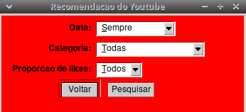
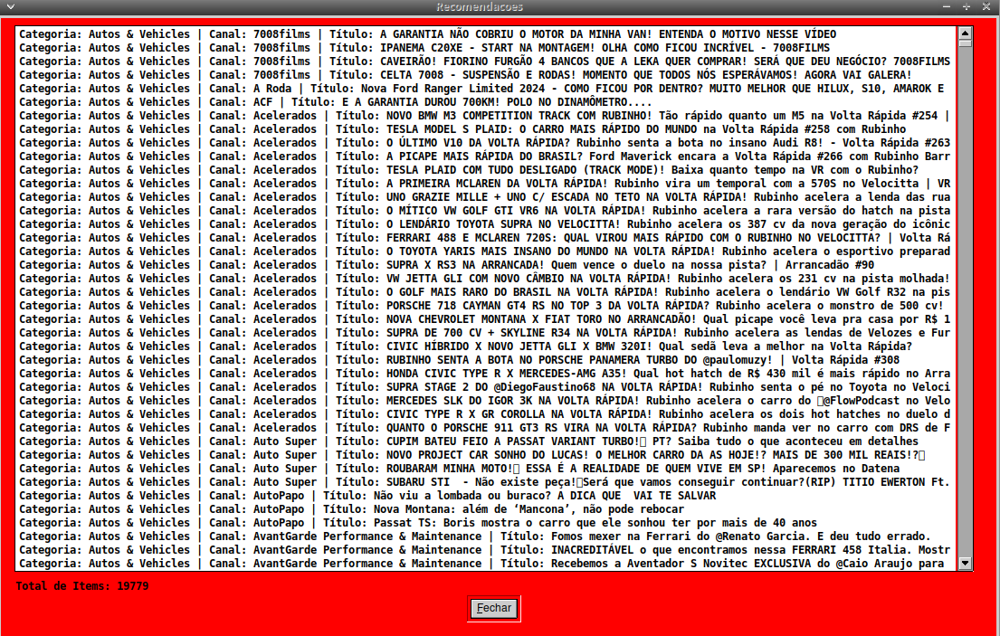

# YouTube Recommendation

**Disciplina**: FGA0210 - PARADIGMAS DE PROGRAMAÇÃO - T01 <br>
**Nro do Grupo**: 02<br>
**Paradigma**: Lógico<br>

## Alunos
|Matrícula | Aluno |
| -- | -- |
| 20/0013181 | Adne Moretti Moreira |
| 20/0057227 | Caio Vitor Carneiro de Oliveira |
| 19/0085819 | Cícero Barrozo Fernandes Filho |
| 19/0045817 | Gabriel Costa de Oliveira |
| 20/0018205 | Gabriel Moretti de Souza |
| 20/0019015 | Guilherme Puida Moreira |
| 20/0067923 | João Henrique Marques Calzavara |
| 20/2023903 | Lucas Lopes Rocha |

## Sobre 
&emsp;&emsp;O projeto se trata de uma ferramenta que usa uma base de dados do Kaggle ([YouTube Trending Video Dataset](https://www.kaggle.com/datasets/rsrishav/youtube-trending-video-dataset?select=BR_youtube_trending_data.csv)) para oferecer recomendações personalizadas de vídeos do YouTube. Você pode refinar suas recomendações por categoria, popularidade (likes por view) e data de publicação. Nossa missão é ajudá-lo a descobrir conteúdo relevante e emocionante de acordo com suas preferências utilizando o paradigma lógico. Este projeto foi inspirado no próprio sistema de filtragem e recomendação do YouTube e no projeto [SpotifyRecommendation](https://github.com/UnBParadigmas2022-1/2022.1_G5_Logico_SpotifyRecommendation).

## Screenshots





## Instalação 
**Linguagens**: Prolog<br>
**Tecnologias**: SWI-Prolog<br>

``` bash
sudo apt-add-repository ppa:swi-prolog/stable
```
``` bash
sudo apt-get update
```
``` bash
sudo apt-get install swi-prolog
```

## Uso 
&emsp;&emsp; Para rodar nosso arquivo main.pl, você deve fazer os seguintes passos, contando que já tenha feito a instalação citada acima do Prolog:

```bash
swipl -s src/main.pl
```

```bash
main.
```

Também é possível executar o projeto com o docker, utilizando o X11Forwarding. Segue comandos de execução com docker: 
```bash 
make build 
```

```bash
make run
```

```bash
main. 
```

## Vídeo
O vídeo de apresentação está disponível em:

- Youtube: [ACESSO]()
- GitHub: [ACESSO]()

## Participações
|Nome do Membro | Contribuição | Significância da Contribuição para o Projeto (Excelente/Boa/Regular/Ruim/Nula) |
| -- | -- | -- |
| Adne Moretti Moreira | Criar filtro de views/likes, integrações finais | Excelente |
| Caio Vitor Carneiro de Oliveira | Criar filtro de views/likes, integrações finais| Excelente |
| Cícero Barrozo Fernandes Filho | Criar filtro de categoria, integrações finais| Excelente |
| Gabriel Costa de Oliveira | Criar filtro de data, separação do menu, integrações finais| Excelente |
| Gabriel Moretti de Souza | Separação do menu, integrações finais | Excelente |
| Guilherme Puida Moreira | Criar banco de dados, ajuda na criação dos filtros, integrações finais | Excelente |
| João Henrique Marques Calzavara | Criar filtro de categoria, integrações finais | Excelente |
| Lucas Lopes Rocha | Criar filtro de data, integrações finais | Excelente |

## Outros

### Lições Aprendidas
- **Paradigma Lógico (Prolog):** A principal lição aprendida foi a compreensão e aplicação do paradigma lógico na programação do sistema de recomendações. Utilizar Prolog como linguagem principal permitiu-nos representar e raciocinar sobre os dados de forma lógica e declarativa, facilitando a manipulação de informações.
- **Processamento de Dados do Kaggle:** Lidar com uma base de dados do Kaggle exigiu habilidades de pré-processamento. Aprendemos a importância da limpeza de dados e do uso eficaz de consultas lógicas para extrair informações relevantes.
- **Recomendações Personalizadas:** Compreendemos como desenvolver algoritmos de recomendação personalizada, considerando preferências do usuário, categorias, popularidade e datas de publicação. A adaptação das recomendações às preferências do usuário foi um desafio significativo.

### Contribuições
- **Implementação Bem-sucedida:** Conseguimos criar com sucesso um sistema de recomendações de vídeos do YouTube baseado em Prolog. Isso permitiu que os usuários recebessem recomendações personalizadas.
- **Utilização Eficiente da Base de Dados do Kaggle:** Aproveitamos ao máximo a base de dados do Kaggle, aproveitando os insights que ela proporcionou para melhorar a qualidade das recomendações.

### Fragilidades
- **Implementação do Paradigma Lógico:** A transição para o paradigma lógico, especificamente o uso do Prolog, representou um desafio considerável para a equipe de desenvolvimento. A lógica declarativa e a abordagem não convencional exigiram tempo para compreensão e ajustes, o que afetou o ritmo do desenvolvimento.

### Possíveis Melhorias
- **Ampliação da Base de Dados:** Buscar fontes de dados adicionais para enriquecer a base de dados e melhorar a variedade e qualidade das recomendações.
- **Inteligência Artificial e Aprendizado de Máquina:** Incorporar técnicas de IA e aprendizado de máquina para aprimorar ainda mais a precisão das recomendações e adaptá-las dinamicamente com base no comportamento de um usuário.
- **Interface do Usuário Aprimorada:** Investir em uma interface de usuário mais amigável e interativa para tornar a experiência do usuário mais agradável.
- **Testes e Avaliações contínuas:** Realizar testes regulares com os usuários para ajustar e melhorar o algoritmo de recomendação com base no feedback real.
- **Expansão para Plataformas Móveis:** Desenvolver versões móveis do programa para atingir um público mais amplo e oferecer recomendações em dispositivos móveis.


## Fontes
- Inspirado em: https://github.com/UnBParadigmas2022-1/2022.1_G5_Logico_SpotifyRecommendation;
- Interface gráfica(XPCE): https://eu.swi-prolog.org/packages/xpce/UserGuide/sec-A.1.html;
- Marca uma ação para todas as ligações alternativas: https://www.swi-prolog.org/pldoc/man?predicate=forall/2
